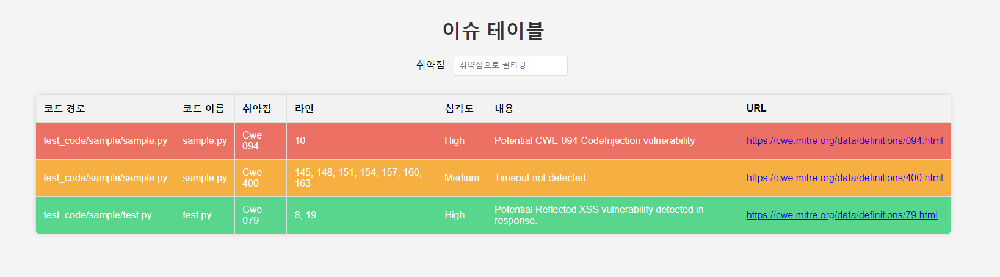

# StaticAnalyze
- 프로젝트 : Python을 이용한 파이썬을 대상으로 하는 정적분석기 제작
- 프로젝트 기간 : 2023.11.01 ~ 2024.01.06
- Language : Python
- 프로젝트 방향성
    - 비전공자에게 도움이 될 수 있는 경험
    - 다양한 취약점에 대한 공부를 진행할 수 있는 기회
    - 시큐어 코딩에 대한 이해도 증진

<br>

## 탐지 방법

ast 구조를 통해서 탐지하는 방법을 채택하였습니다.
취약점 부분의 코드의 ast 구조를 분석하고, 탐지할 수 있도록 패턴을 작성하였으며,
이러한 패턴을 통해서 분석하고자 하는 git_url, dir, url_list를 받아서 분석하여,
결과를 도출해낼 수 있도록 하였습니다.
<br>

### Project Member
**Team name : 세스코**   
- **Project Advisor** : 김진영 [PinguJace](https://github.com/PinguJace)
- **Project Leader**: 홍승표 [Phantomn](https://github.com/Phantomn)
- **Project Manager** : 유재헌 [SoteriaJ](https://github.com/SoteriaJ) 
- 유건우 [Ryu-GeonWoo](https://github.com/Ryu-GeonWoo) 
- 한동혁 [OverDlive](https://github.com/OverDlive)
- 여경민 [GyeongminY](https://github.com/GyeongminY)   
- 김동연 [bbong0069](https://github.com/bbong0069) 
- 유선재 [mameul](https://github.com/mameul) 
- 오윤석 [lux-02](https://github.com/lux-02) 

<br>

### 실행 방법

1. 프로젝트를 클론합니다:

    ```bash
    git clone https://github.com/WHS-project/Analyze
    cd yourstaticanalyzer
    ```

2. 클론한 폴더로 이동합니다:

    ```bash
    cd yourstaticanalyzer
    ```


3. 분석 타입별 실행 방법
    ```bash
    Usage: python main.py url <git_url>
    Usage: python main.py dir <Repo_Dir> 
    Usage: python main.py code <Python code to analyze>
    Usage: python main.py list <url list txt>
    ``` 

4. 분석결과는 result 폴더 안에 생성됩니다.

    ```json
    {
        "repo_path": "test_code/sample",
        "code": {
            "sample.py": {
                "code_path": "test_code/sample/sample.py",
                "code_name": "sample.py",
                "issues": [
                    {
                        "function_name": "Cwe Number",
                        "line": "code-line",
                        "severity": "High, Medium, Low",
                        "content": "CWE comment",
                        "url": "CWE url"
                    },
                ]
            }
        }
    }
    ```
    취약점 number 검색을 통해서 필터링 할 수 있습니다.
    

<br>

### 지원하는 CWE 목록

이 정적 분석기는 다음과 같은 Common Weakness Enumeration (CWE) 목록을 지원합니다:

- CWE_020
- CWE_022
- CWE_078
- CWE_079
- CWE_089
- CWE_094
- CWE_116
- CWE_117
- CWE_200
- CWE_209
- CWE_215
- CWE_259
- CWE_269
- CWE_285
- CWE_312
- CWE_326
- CWE_327
- CWE_377
- CWE_400
- CWE_426
- CWE_476
- CWE_502
- CWE_601
- CWE_611
- CWE_643
- CWE_703
- CWE_776
- CWE_918
- CWE_943